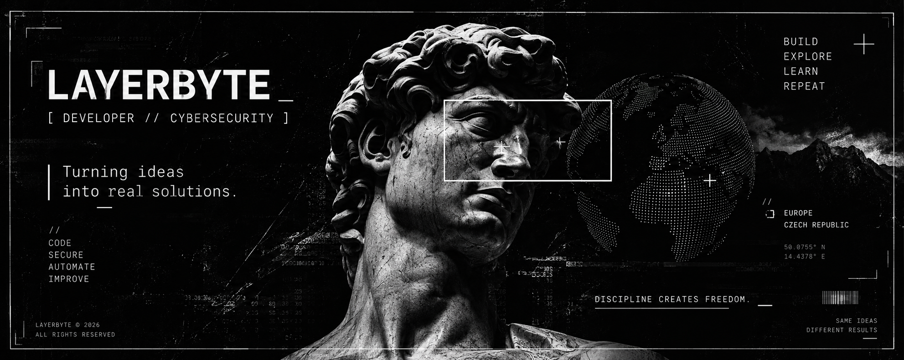
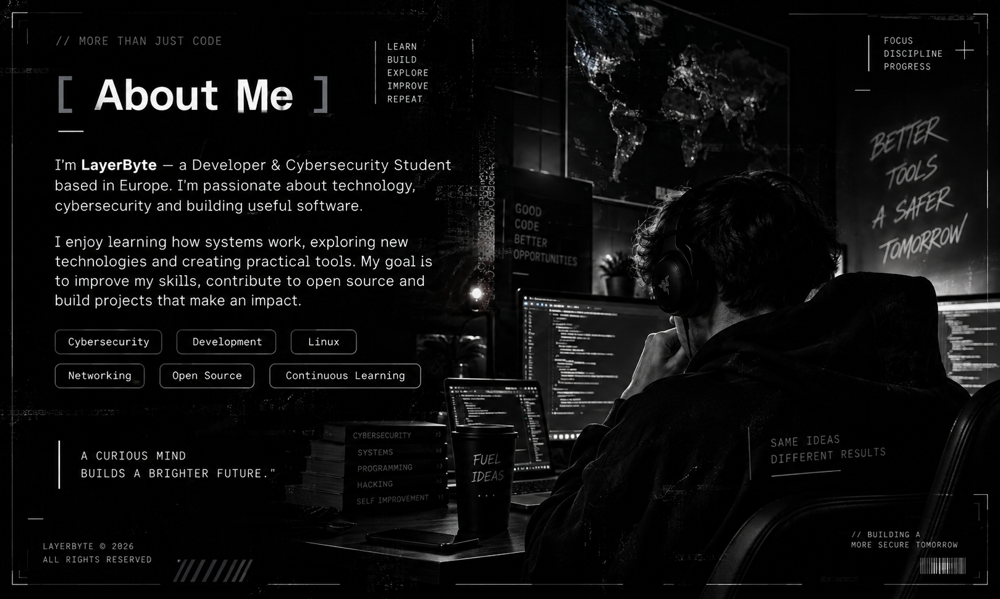
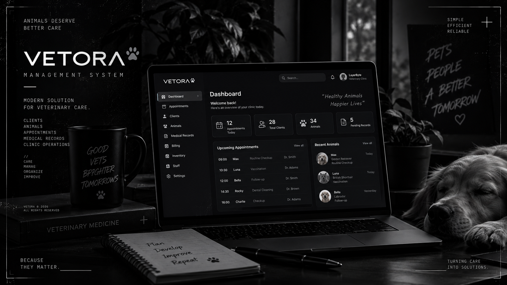

<div align="center">



<br>

# ❯ [ Hi, I'm LayerByte_ ]

### Developer & Cybersecurity Student


<br>

<a href="https://github.com/LayerByte">

</a>

&nbsp;

<a href="https://github.com/LayerByte?tab=repositories">

</a>

&nbsp;


</div>

<br>

---

## ❯ [ About Me ]



I'm **LayerByte** — a Developer & Cybersecurity Student based in Europe.

I'm passionate about **technology, cybersecurity and building useful software**.

I enjoy learning how systems work, exploring new technologies and creating practical tools.

Currently, I'm focused on improving my skills in:

`Cybersecurity` `Development` `Linux`

`Networking` `Open Source` `Automation`

<br>

My goal is simple:

> Build useful software, understand systems and keep improving.

<br clear="right"/>

---

## ❯ [ Connect ]

<div align="center">

<a href="https://github.com/LayerByte">

</a>

&nbsp;&nbsp;&nbsp;

<a href="https://tryhackme.com/p/X3roxDev">

</a>

</div>

<br>

---

## ❯ [ Tech Stack ]

<div align="center">

### Languages


<br><br>

### Web & Databases


<br><br>

### DevOps & Tools


<br><br>

### Systems & Security


</div>

<br>

---

## ❯ [ Featured Project ]

<table>
<tr>
<td width="40%">



</td>

<td width="60%">

### Vetora Management System

Modern veterinary management system designed for managing clients, animals, appointments and clinic operations.

**Stack**

`Web` `Database` `Management System`

<br>

<a href="https://vetora-five.vercel.app/">

</a>

<a href="https://github.com/LayerByte">

</a>

</td>
</tr>
</table>

<br>

---

## ❯ [ GitHub Stats ]

<div align="center">


<br><br>


</div>

<br>

---

## ❯ [ Profile Summary ]

<div align="center">


<br>

</div>

<br>

---

<div align="center">

```text
SAME IDEAS, DIFFERENT RESULTS

D I S C I P L I N E .
```

<sub>LAYERBYTE © 2026</sub>

<br>

<sub>BUILD // EXPLORE // LEARN // REPEAT</sub>

</div>
